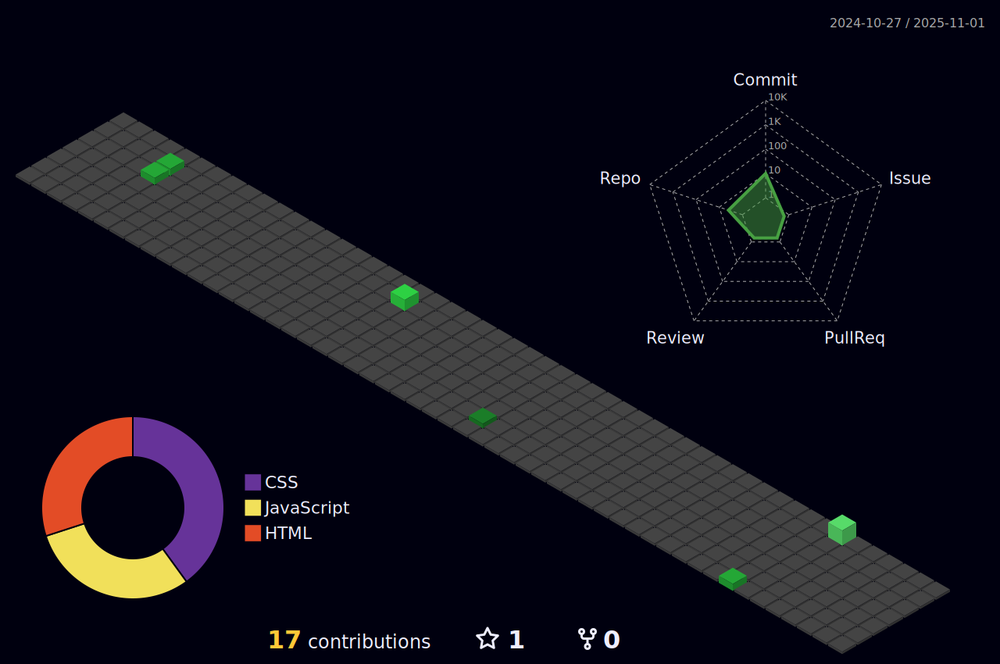

  <h1>Hi!, I'm João Pedro!😀😎<h1/>

 
 
 

    
 <h2>Languages and Tools</h2>

 
 
               
               
               
               
               

 

<a href="https://github.com/joaopdrost">

  

  
  <h2>Social networks</h2>
  

 
 
  
  
  <a href= "https://twitter.com/joaopdrost" target="_blank">

  
  

 

